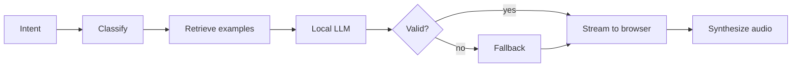

# SCORE

Generate focus and study music tailored to what you're doing, from an AI model that runs entirely on your own machine. No cloud, no telemetry.

You pick a focus style, and a local language model composes a binaural-beat session (binaural beats: two slightly offset tones the ear blends into one steady pulse) that plays in your browser and is built to adapt to your feedback over time.


**Demo:** runs locally in a few commands; see [Run, Build, Test](#run-build-test).

---

## At a Glance

You choose a focus style (deep focus, light focus, sleep aid, and more), and SCORE generates a custom session of binaural-beat parameters that change over time to hold your attention. The session streams to your browser, plays instantly, and you can adjust any setting live.

Everything runs locally: a 9B-parameter model on a consumer GPU, with every generated session checked for validity before it plays.

**Status.** The core pipeline runs end to end: pick a style, a local model generates a validated session, and it plays in the browser. In progress: text intent understanding, retrieval of past sessions you rated well, and tighter server-side validation.

---

## Architecture

You choose an intent, which seeds a prompt for a local language model. The model returns a JSON session of binaural-beat parameters across time. The session is checked for schema, value ranges, and smooth transitions; anything invalid falls back to a safe per-intent preset. The valid session streams to the browser, where Tone.js plays it with smooth ramps, and your feedback feeds back into the examples that shape the next one.



---

## Features

**Intent-based sessions.** You pick a focus style (deep focus, light focus, creative flow, calm, sleep aid) and describe it in your own words. The choice seeds both the prompt and the session template. A small classifier sorts your input into the fixed set of styles and generates schedule based on intent.

**Real-time control.** Beat frequency, tempo, and audio layers ramp smoothly across each step of the session, and you can override any slider while it plays. Tone.js ramps every parameter on the client so nothing jumps abruptly.

**Learns from your feedback.** Sessions you rate well are designed to bias the next generation as examples, improving results rather than retraining the model.

**Validated output.** Every session is checked against a fixed schema and value ranges before it plays. Constrained decoding will bound the JSON as the model generates it, and a per-intent fallback catches anything invalid.

---

## Key Decisions and Tradeoffs

| Decision | Why | Alternative rejected |
|---|---|---|
| Local inference, not a cloud API | Session text describes how you feel and think so it should not leave your machine. Cloud also adds a latency floor and per-session cost. | Hosted API (forces telemetry by default, 200-800 ms network latency floor, unnecessary cost at session scale) |
| Fixed set of session styles | Canonical labels keep accuracy meaningful and give the fallback concrete targets | Open-set classification by similarity |
| Retrieval before fine-tuning | Cheapest signal that compounds with use: no training cost, no GPU, improvement at generation time | LoRA fine-tuning (data to be added) |
| Constrained decoding | Bounds the JSON structure as the model generates, removing the malformed-output retry path | Generate then validate-and-retry (adds a latency tail and a failure path) |
| 8-bit quantization on the HuggingFace stack | Output is JSON, so quantization noise becomes a validation error, not slightly worse meaning since the same stack hosts fine-tuning later |

---

## Designed for Focus

The focus-first design is enforced in code, not left to the model:

- **Smooth transitions.** No parameter jumps more than 20% of its range per second
- **You stay in control.** Sliders override the model in real time, and each edit becomes a feedback signal.
- **Instant stop.** A keyboard shortcut and a large button stop audio with no confirmation dialog, so sensory overwhelm is never trapped behind a multi-step flow.

---

## Run, Build, Test

**Requires:** Python 3.10+, Node 20+, 16 GB RAM. A CUDA GPU or Apple Silicon is recommended. Docker optional. The model downloads on first backend run which will be several gigabytes.

```bash
git clone https://github.com/Abhi6310/SCORE.git
cd SCORE

# backend
python -m venv .venv && source .venv/bin/activate
pip install -e ./backend

# frontend (separate terminal)
cd frontend && npm install

# optional: MySQL via Docker
docker compose up -d
```

Run both servers in separate terminals:

```bash
# terminal 1: backend (downloads the model on first run)
source .venv/bin/activate && python backend/main.py

# terminal 2: frontend
cd frontend && npm run dev  #http://localhost:3000
```

Configuration lives in `backend/config.py`, overridable via a project-root `.env`:

---

## Tech Stack

**Frontend:** Next.js 14 (App Router), Tone.js, Redux Toolkit, TypeScript

**Backend:** Python 3.10+, FastAPI, async SQLAlchemy, Pydantic, WebSocket

**ML:** HuggingFace Transformers, sentence-transformers, outlines (constrained decoding), librosa. The model runs quantized with bitsandbytes (`8bit` by default, `4bit` for tighter memory), which keeps a direct path to fine-tuning on feedback data later without a second runtime.

**Storage:** SQLite by default; MySQL via Docker for development

---

## Known Limitations

- **Single-user, local deployment by design.** No multi-tenant serving and no hosted endpoint; the on-device story is the point.
- **Adaptation ships as retrieval first**, and the system is not yet benchmarked. Classifier retraining and preference tuning are deferred until the retrieval signal plateaus.

---

## Project Structure

```
SCORE/
├── backend/
│   ├── nlp/             prompt classifiers, templates, validators
│   ├── llm_engine/      llm model and decoding
│   ├── audio_processor/ librosa-driven track analysis
│   ├── routers/         REST + WebSocket endpoints
│   ├── models/          ORM + Pydantic schemas
│   ├── db/              async session engine
│   └── config.py
├── frontend/src/
│   ├── app/             Next.js routes
│   ├── lib/             Tone.js synth, REST + WebSocket clients
│   └── stores/          Redux Toolkit slices
└── docker-compose.yml
```

---

MIT License
